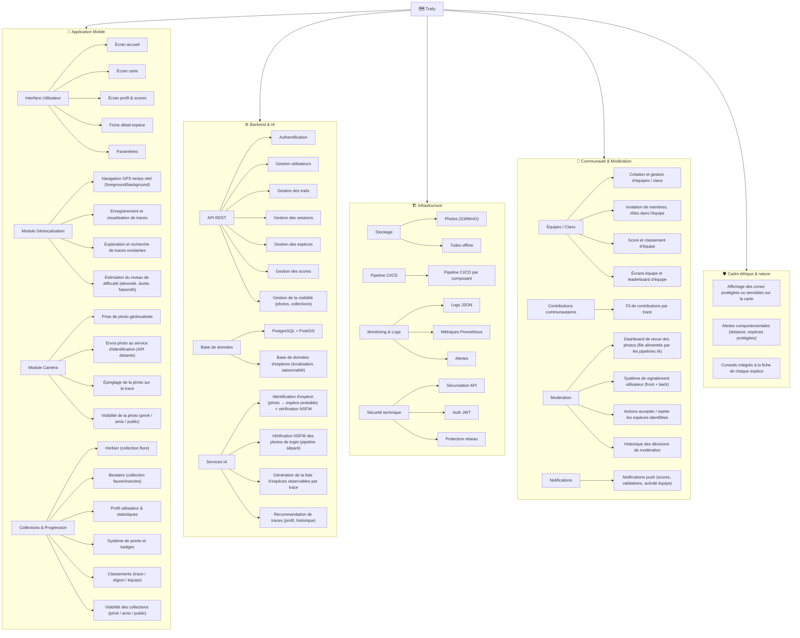

# Product Breakdown Structure — Traily

```mermaid
graph TD
    TRAILY["🗺️ Traily"]

    TRAILY --> AM
    TRAILY --> BE
    TRAILY --> INF
    TRAILY --> COM
    TRAILY --> ETH

    subgraph AM["📱 Application Mobile"]

        UI["Interface Utilisateur"]
        GEO["Module Géolocalisation"]
        CAM["Module Caméra"]
        COL["Collections & Progression"]

        UI --> UI1["Écran accueil"]
        UI --> UI2["Écran carte"]
        UI --> UI3["Écran profil & scores"]
        UI --> UI4["Fiche détail espèce"]
        UI --> UI5["Paramètres"]

        GEO --> GEO1["Navigation GPS temps réel (foreground/background)"]
        GEO --> GEO2["Enregistrement et visualisation de traces"]
        GEO --> GEO3["Exploration et recherche de traces existantes"]
        GEO --> GEO4["Estimation du niveau de difficulté (dénivelé, durée, Naismith)"]

        CAM --> CAM1["Prise de photo géolocalisée"]
        CAM --> CAM2["Envoi photo au service d'identification (API distante)"]
        CAM --> CAM3["Épinglage de la photo sur la trace"]
        CAM --> CAM4["Visibilité de la photo (privé / amis / public)"]

        COL --> COL1["Herbier (collection flore)"]
        COL --> COL2["Bestiaire (collection faune/insectes)"]
        COL --> COL3["Profil utilisateur & statistiques"]
        COL --> COL4["Système de points et badges"]
        COL --> COL5["Classements (trace / région / équipe)"]
        COL --> COL6["Visibilité des collections (privé / amis / public)"]
    end

    subgraph BE["⚙️ Backend & IA"]

        API["API REST"]
        BDD["Base de données"]
        IAS["Services IA"]

        API --> API1["Authentification"]
        API --> API2["Gestion utilisateurs"]
        API --> API3["Gestion des trails"]
        API --> API4["Gestion des sessions"]
        API --> API5["Gestion des espèces"]
        API --> API6["Gestion des scores"]
        API --> API7["Gestion de la visibilité (photos, collections)"]

        BDD --> BDD1["PostgreSQL + PostGIS"]
        BDD --> BDD2["Base de données d'espèces (localisation, saisonnalité)"]

        IAS --> IAS1["Identification d'espèce (photo → espèce probable) + vérification NSFW"]
        IAS --> IAS2["Vérification NSFW des photos de trajet (pipeline séparé)"]
        IAS --> IAS3["Génération de la liste d'espèces observables par trace"]
        IAS --> IAS4["Recommandation de traces (profil, historique)"]
    end

    subgraph INF["🏗️ Infrastructure"]

        STO["Stockage"]
        CI["Pipeline CI/CD"]
        MON["Monitoring & Logs"]
        SEC["Sécurité technique"]

        STO --> STO1["Photos (S3/MinIO)"]
        STO --> STO2["Tuiles offline"]

        CI --> CI1["Pipeline CI/CD par composant"]

        MON --> MON1["Logs JSON"]
        MON --> MON2["Métriques Prometheus"]
        MON --> MON3["Alertes"]

        SEC --> SEC1["Sécurisation API"]
        SEC --> SEC2["Auth JWT"]
        SEC --> SEC3["Protection réseau"]
    end

    subgraph COM["👥 Communauté & Modération"]

        TEAM["Équipes / Clans"]
        FEED["Contributions communautaires"]
        MOD["Modération"]
        NOTIF["Notifications"]

        TEAM --> TEAM1["Création et gestion d'équipes / clans"]
        TEAM --> TEAM2["Invitation de membres, rôles dans l'équipe"]
        TEAM --> TEAM3["Score et classement d'équipe"]
        TEAM --> TEAM4["Écrans équipe et leaderboard d'équipe"]

        FEED --> FEED1["Fil de contributions par trace"]

        MOD --> MOD1["Dashboard de revue des photos (file alimentée par les pipelines IA)"]
        MOD --> MOD2["Système de signalement utilisateur (front + back)"]
        MOD --> MOD3["Actions accepter / rejeter les espèces identifiées"]
        MOD --> MOD4["Historique des décisions de modération"]

        NOTIF --> NOTIF1["Notifications push (scores, validations, activité équipe)"]
    end

    subgraph ETH["🛡️ Cadre éthique & nature"]

        ZON["Affichage des zones protégées ou sensibles sur la carte"]
        ALERT["Alertes comportementales (distance, espèces protégées)"]
        ADV["Conseils intégrés à la fiche de chaque espèce"]
    end
```
